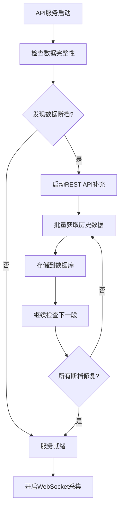
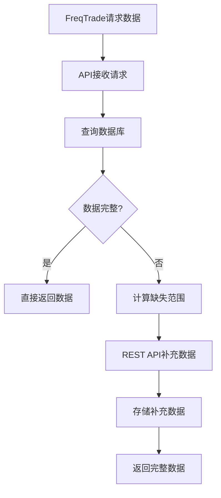
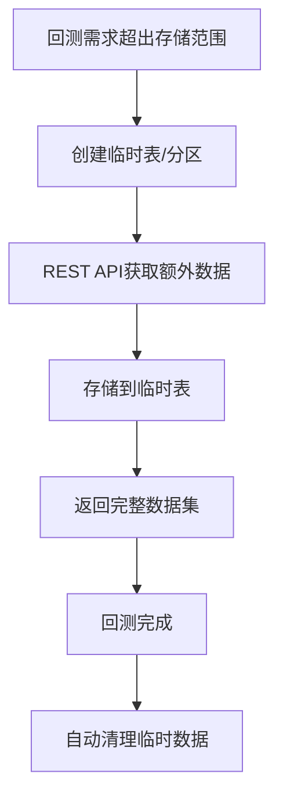

# Cryptofeed API Service Architecture Design

## 📋 项目概述

本文档描述了Cryptofeed项目的统一API服务架构设计，该架构将数据采集和API服务融合为一个统一的`cryptofeed_api`服务，旨在为FreqTrade量化交易系统提供完整的数据解决方案。

## 🎯 核心问题与目标

### 当前架构痛点
1. **冷启动问题** - WebSocket只能获取实时数据，历史数据需要慢慢积累
2. **数据连续性** - 服务重启导致数据断档
3. **响应延迟** - FreqTrade启动时需要等待数据积累
4. **缺乏灵活性** - 无法按需获取特定时间段的历史数据
5. **存储成本** - 长期存储所有历史数据成本较高

### 设计目标
- ✅ 提供快速的历史数据补充机制
- ✅ 保证数据连续性和完整性
- ✅ 支持按需获取任意时间段数据
- ✅ 控制存储成本，动态管理数据
- ✅ 简化FreqTrade的数据获取逻辑

## 🏗️ 整体架构设计（融合架构）

```
┌─────────────────┐     ┌────────────────────────────────────────┐     ┌─────────────────┐
│   FreqTrade     │────▶│          cryptofeed_api                │────▶│   PostgreSQL    │
│  (量化交易)      │     │  ┌───────────────────────────────────┐ │     │   (TimescaleDB) │
└─────────────────┘     │  │        FastAPI Web Service        │ │     └─────────────────┘
                        │  │    ┌─────────────────────────────┐ │ │              ▲
                        │  │    │     API Endpoints           │ │ │              │
                        │  │    │ /candles /trades /funding   │ │ │              │
                        │  │    └─────────────────────────────┘ │ │              │
                        │  └───────────────────────────────────┘ │              │
                        │  ┌───────────────────────────────────┐ │              │
                        │  │    Data Collection Monitor        │ │──────────────┘
                        │  │  ┌─────────────────────────────┐  │ │
                        │  │  │    WebSocket Streams        │  │ │
                        │  │  │    Symbol Manager           │  │ │
                        │  │  └─────────────────────────────┘  │ │
                        │  └───────────────────────────────────┘ │
                        │  ┌───────────────────────────────────┐ │
                        │  │   Historical Data Service         │ │
                        │  │  ┌─────────────────────────────┐  │ │
                        │  │  │  Binance REST Client        │  │ │
                        │  │  │  Data Integrity Check       │  │ │
                        │  │  │  Gap Detection & Fill       │  │ │
                        │  │  └─────────────────────────────┘  │ │
                        │  └───────────────────────────────────┘ │
                        └────────────────────────────────────────┘
```

## 🎯 **融合架构核心理念**

### ✅ **单一服务，双重职责**
- **数据采集**: 持续的WebSocket实时数据收集
- **API服务**: RESTful接口提供数据查询和历史补充
- **内存共享**: 两个功能共享配置、连接池、缓存等资源
- **统一管理**: 一个进程、一个配置、一个部署单元

### 🏗️ **项目结构设计**

```
cryptofeed/                           # 原cryptofeed库
├── cryptofeed/                       # 核心交易所连接库
├── examples/                         # 官方示例
└── docs/                            # 库文档

cryptofeed_api/                      # 统一数据API服务 ⭐
├── __init__.py
├── main.py                          # FastAPI + 数据采集统一入口
├── api/                             # Web API模块
│   ├── __init__.py
│   ├── v1/                          # API版本控制
│   │   ├── __init__.py
│   │   ├── candles.py              # K线数据端点
│   │   ├── trades.py               # 交易数据端点
│   │   ├── funding.py              # 资金费率端点
│   │   └── health.py               # 健康检查端点
│   ├── dependencies.py             # API依赖注入
│   └── middleware.py               # 中间件
├── monitor/                         # 数据采集模块（现有逻辑迁移）
│   ├── __init__.py
│   ├── data_collector.py           # 主数据收集器
│   ├── symbol_manager.py           # 符号管理器
│   ├── backends/                   # 存储后端
│   │   ├── __init__.py
│   │   └── postgres_backends.py
│   └── services/                   # 采集相关服务
├── services/                       # 共享业务逻辑
│   ├── __init__.py
│   ├── data_integrity.py           # 数据完整性检查
│   ├── data_supplement.py          # 历史数据补充
│   ├── binance_client.py           # REST API客户端
│   └── temp_data_manager.py        # 临时数据管理
├── models/                         # 数据模型
│   ├── __init__.py
│   ├── database.py                 # SQLAlchemy模型
│   ├── schemas.py                  # Pydantic响应模型
│   └── enums.py                    # 枚举类型
├── core/                           # 核心配置
│   ├── __init__.py
│   ├── config.py                   # 配置管理
│   ├── database.py                 # 数据库连接
│   └── logging.py                  # 日志配置
└── utils/                          # 工具类
    ├── __init__.py
    ├── helpers.py
    └── validators.py

run.py                               # 统一启动脚本
config/main.yaml                     # 统一配置文件
```

### 🔄 **服务启动流程**

```python
# main.py - 统一入口点
from fastapi import FastAPI
import asyncio

app = FastAPI(title="Cryptofeed API Service")

@app.on_event("startup")
async def startup_event():
    # 1. 初始化数据库连接
    await init_database()

    # 2. 检查数据完整性并补充
    await check_and_supplement_data()

    # 3. 启动WebSocket数据采集
    asyncio.create_task(start_data_collection())

    # 4. API服务就绪
    logger.info("Cryptofeed API Service Ready")

@app.get("/api/v1/candles/{symbol}")
async def get_candles(symbol: str):
    # 直接查询同一个数据库
    return await query_candles(symbol)
```

## 🔄 核心工作流程

### 1. 服务启动流程


### 2. 数据请求流程


### 3. 临时数据扩展流程


## 🚀 性能与效率优化

### REST API vs WebSocket 效率对比
| 方式 | 1年5分钟数据获取时间 | 优缺点 |
|------|---------------------|--------|
| **WebSocket逐条** | ~28小时 | ❌ 极慢，需要实时等待 |
| **REST API批量** | ~2-3小时 | ✅ 快速，受限于API限流 |

### API限流管理策略
- **Binance限制**：1200请求/分钟，10请求/秒
- **批次控制**：每次请求获取最大允许数据量
- **智能间隔**：动态调整请求频率，避免触碰限制
- **断点续传**：支持中断后从断点继续补充

### 存储成本优化
```yaml
数据保留策略:
  常规存储: 1年数据 (~100MB/symbol)
  临时扩展: 按需创建，自动清理
  分区管理: 按月分区，便于管理
  压缩优化: TimescaleDB自动压缩历史数据
```

## 🛠️ API接口设计

### 核心端点规划
```http
# 获取K线数据
GET /api/v1/candles/{symbol}/{interval}
Query: start_time, end_time, limit

# 获取交易数据
GET /api/v1/trades/{symbol}
Query: start_time, end_time, limit

# 获取资金费率
GET /api/v1/funding/{symbol}
Query: start_time, end_time

# 数据完整性检查
GET /api/v1/health/data-integrity/{symbol}

# 临时数据管理
POST /api/v1/temp-data/create
DELETE /api/v1/temp-data/{temp_id}
```

### 响应格式统一
```json
{
  "status": "success",
  "data": [...],
  "metadata": {
    "symbol": "BTC-USDT-PERP",
    "interval": "5m",
    "count": 10000,
    "start_time": "2023-01-01T00:00:00Z",
    "end_time": "2024-01-01T00:00:00Z",
    "data_source": "database|rest_api",
    "completeness": 100
  }
}
```

## 🔒 数据完整性保障

### 断档检测机制
```python
def detect_data_gaps(symbol: str, interval: str, start: datetime, end: datetime):
    """
    检测指定时间范围内的数据断档
    返回需要补充的时间段列表
    """
    expected_count = calculate_expected_records(interval, start, end)
    actual_count = query_actual_records(symbol, interval, start, end)

    if actual_count < expected_count:
        return find_missing_ranges(symbol, interval, start, end)
    return []
```

### 数据质量验证
- **时间戳连续性**：检查K线数据时间间隔是否正确
- **数据合理性**：价格、交易量等数值范围验证
- **重复检测**：避免补充数据时产生重复记录
- **完整性评分**：计算数据完整度百分比

## 📊 监控与运维

### 关键指标监控
```yaml
性能指标:
  - API响应时间
  - 数据库查询延迟
  - REST API调用频率
  - 数据补充速度

数据指标:
  - 数据完整性百分比
  - 实时数据延迟
  - 存储空间使用率
  - 临时数据清理状态

系统指标:
  - CPU和内存使用率
  - 数据库连接池状态
  - WebSocket连接状态
  - 错误率和重试次数
```

### 告警策略
- **数据断档超过1小时** → 立即告警
- **API响应时间超过5秒** → 性能告警
- **存储空间使用超过80%** → 容量告警
- **REST API限流触发** → 限流告警

## 🛡️ 容错与恢复机制

### 故障场景处理
1. **REST API请求失败**
   - 指数退避重试机制
   - 降级策略：返回部分可用数据
   - 失败记录：待后续补充

2. **数据库连接中断**
   - 连接池自动重连
   - 请求队列缓存
   - 健康检查端点

3. **WebSocket连接断开**
   - 自动重连机制
   - 断线期间数据补充
   - 状态同步验证

### 数据一致性保证
```python
@transaction
def supplement_historical_data(symbol: str, start: datetime, end: datetime):
    """
    事务保证：要么全部成功，要么全部回滚
    """
    try:
        gaps = detect_data_gaps(symbol, start, end)
        for gap in gaps:
            data = fetch_from_binance_rest(symbol, gap.start, gap.end)
            validate_data_quality(data)
            store_to_database(data)
        commit_transaction()
    except Exception as e:
        rollback_transaction()
        raise DataSupplementError(f"Failed to supplement data: {e}")
```

## 🚀 部署与扩展

### Docker化部署（融合架构）
```yaml
# docker-compose.yml
services:
  cryptofeed-api:
    build: .
    environment:
      - DATABASE_HOST=timescale-crypto
      - DATABASE_PORT=5432
      - DATABASE_USER=postgres
      - DATABASE_PASSWORD=password
      - DATABASE_NAME=cryptofeed
    ports:
      - "8000:8000"     # FastAPI服务端口
    depends_on:
      - timescale-crypto
    volumes:
      - ./logs:/app/logs
      - ./config:/app/config
    restart: unless-stopped

  timescale-crypto:
    image: timescale/timescaledb:latest
    environment:
      - POSTGRES_DB=cryptofeed
      - POSTGRES_USER=postgres
      - POSTGRES_PASSWORD=password
    ports:
      - "5432:5432"
    volumes:
      - postgres_data:/var/lib/postgresql/data
    restart: unless-stopped

volumes:
  postgres_data:
```

### 简化的Dockerfile
```dockerfile
FROM python:3.11-slim

WORKDIR /app

# 安装系统依赖
RUN apt-get update && apt-get install -y gcc && rm -rf /var/lib/apt/lists/*

# 复制并安装Python依赖
COPY requirements.txt .
RUN pip install --no-cache-dir -r requirements.txt

# 复制应用代码
COPY cryptofeed_api/ ./cryptofeed_api/
COPY cryptofeed/ ./cryptofeed/
COPY config/ ./config/
COPY run.py .

# 健康检查
HEALTHCHECK --interval=30s --timeout=30s --start-period=5s --retries=3 \
    CMD curl -f http://localhost:8000/health || exit 1

EXPOSE 8000

# 启动统一服务
CMD ["python", "run.py"]
```

### 水平扩展策略
- **API服务**：多实例负载均衡
- **数据采集**：按交易对分片
- **数据库**：TimescaleDB分布式部署
- **缓存层**：可选Redis集群（按需）

## 💡 最佳实践建议

### 开发实践
1. **API版本管理** - 使用语义化版本，保证向后兼容
2. **错误处理** - 统一错误码和错误信息格式
3. **日志规范** - 结构化日志，便于监控和调试
4. **文档维护** - API文档实时更新，包含示例代码

### 运维实践
1. **渐进式发布** - 灰度发布，监控指标
2. **数据备份** - 定期备份关键数据
3. **容量规划** - 监控增长趋势，提前扩容
4. **安全加固** - API访问控制，数据传输加密

## 📈 未来扩展方向

### 短期优化（1-3个月）
- [ ] 实现基础API服务和数据补充功能
- [ ] 完成与FreqTrade的集成测试
- [ ] 建立监控和告警体系
- [ ] 优化数据补充算法效率

### 中期扩展（3-6个月）
- [ ] 支持更多交易所数据源
- [ ] 实现智能数据预加载
- [ ] 增加数据分析和统计功能
- [ ] 开发Web管理界面

### 长期规划（6-12个月）
- [ ] 机器学习驱动的数据质量优化
- [ ] 分布式架构支持
- [ ] 实时数据流处理优化
- [ ] 多租户支持

## 📝 总结

本架构设计通过**融合架构**，将数据采集和API服务统一到`cryptofeed_api`中，有效解决了当前Cryptofeed项目的数据管理痛点：

**✅ 核心优势**
- **架构简洁**：单一服务，双重职责，避免微服务复杂性
- **快速冷启动**：REST API批量补充，比WebSocket逐条快10倍以上
- **数据完整性**：自动检测和修复数据断档，保证连续性
- **成本可控**：动态数据管理，按需扩展，无需Redis缓存
- **内存共享**：数据采集和API服务共享资源，性能更优
- **部署简单**：单容器部署，运维成本低
- **高度兼容**：无缝集成现有FreqTrade工作流程

**🎯 融合架构核心价值**
- **统一管理**：一个配置文件、一个启动脚本、一个部署单元
- **实时响应**：内存直接访问，无跨服务通信延迟
- **资源优化**：共享数据库连接池、配置管理、日志系统
- **开发高效**：代码复用率高，维护成本低

**📊 实施路径**
1. **渐进迁移**：将现有`src/`代码迁移到`cryptofeed_api/monitor/`
2. **功能叠加**：在同一服务中集成FastAPI Web框架
3. **统一入口**：通过`main.py`同时启动数据采集和API服务
4. **Docker化**：单容器包含完整功能，简化部署

**🚀 适用场景**
该融合架构特别适合：
- 个人或小团队的量化交易项目
- 对架构复杂度敏感的场景
- 资源（内存、CPU）有限的环境
- 需要快速迭代的项目

该架构为Cryptofeed项目的生产化部署奠定了坚实基础，能够以最简洁的方式满足专业量化交易的数据需求。

---

**文档版本**: v1.0
**创建日期**: 2024-09-25
**更新日期**: 2024-09-25
**作者**: Cryptofeed Team

> 💡 **提示**: 本文档将随着项目发展持续更新，建议定期查看最新版本。